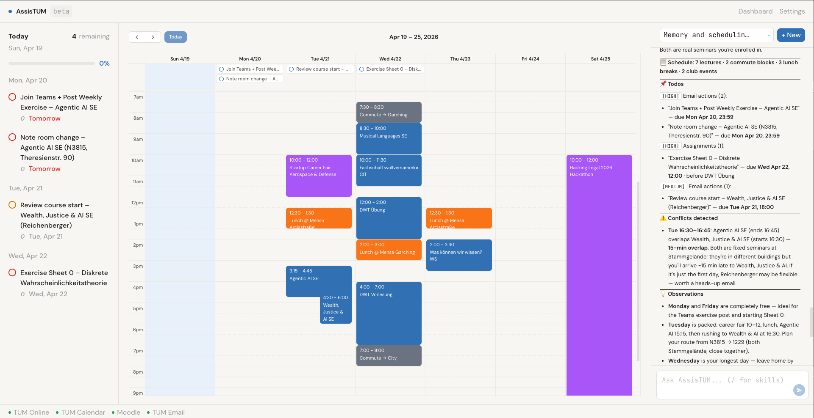

# AssisTUM

AI-powered student assistant for TUM that unifies scattered university systems into a single agent-driven interface.



## Problem

TUM students juggle 5+ disconnected systems daily — Moodle for assignments, TUM Online for lectures and grades, email for deadlines, iCal for schedules, NavigaTUM for rooms, MVV for transit, and Mensa for food. Coordinating all of this manually is tedious, error-prone, and wastes hours every week. There's no single place to see your week, catch conflicts, or act on deadlines.

## Solution

AssisTUM connects to all TUM systems through a single interface with an AI agent that can read your data, plan your week, and take actions on your behalf. You chat with the agent, invoke skills like `/plan-week`, and it handles the rest — importing lectures, pulling Moodle assignments, scanning emails, scheduling study sessions, resolving conflicts, and checking commute times.

## Features

- **Moodle** — auto-login via Shibboleth SAML, browse courses, view assignments, extract PDFs
- **TUM Online** — lectures, grades, course sync via API token
- **Calendar** — iCal import, drag-and-drop rescheduling, color-coded event types
- **Email** — IMAP inbox monitoring, send via SMTP, agent turns emails into todos
- **Canteen** — daily Mensa menu, live occupancy
- **Transit** — real-time MVV departures, agent-powered commute planning
- **Study Rooms** — live availability via ASTA API
- **Campus Navigation** — NavigaTUM room and building search
- **Student Clubs** — event scraping and calendar integration
- **Dashboard** — at-a-glance stats, upcoming events, today's lunch, urgent todos
- **Task Management** — priority-based todos linked to courses and assignments

See [features.md](features.md) for detailed feature descriptions.

## Pitch Deck & Demo

[View the pitch deck (PDF)](pitch-deck/assistum-pitch-deck.pdf)

Watch the demo video:

[](https://youtu.be/GF9egQOTlLk)

## Agent Skills

Slash commands that trigger multi-step agent workflows:

| Skill | What it does |
|-------|-------------|
| `/plan-week` | 6-phase automated weekly planning: lectures, assignments, emails, meals, clubs, conflicts |
| `/course-brainstorm` | Discuss course strategy, fetch Moodle materials, create study sessions |
| `/schedule-study-sessions` | Find calendar gaps and block study time based on deadlines |
| `/conflict-resolver` | Detect overlapping events and suggest resolutions |
| `/commute-helper` | Plan commute using live MVV departures + NavigaTUM |
| `/find-study-room` | Search for available study rooms near your location |

## Architecture

```
Frontend (React 19 + Vite)
  ├── Calendar (FullCalendar)
  ├── Chat panel (SSE streaming)
  ├── Dashboard, Todos, Settings
  └── connects to backend via /api/*

Backend (Express 5 + SQLite)
  ├── REST API (events, todos, courses, auth, settings)
  ├── SSE broadcast (/api/stream)
  ├── MCP tool server (15+ tools)
  ├── Shibboleth SAML for Moodle
  └── connects to OpenCode agent engine

OpenCode (agent runtime)
  └── executes MCP tools, manages sessions, streams responses
```

## Tech Stack

**Frontend:** React 19, TypeScript, Vite, Tailwind CSS, FullCalendar, TanStack React Query, Radix UI

**Backend:** Express 5, TypeScript, SQLite (better-sqlite3), MCP SDK, OpenCode SDK

**Agent:** OpenCode (open-source agent engine), 15+ MCP tools across actions, fetch, and live categories

## Getting Started

### Prerequisites

- Node.js 22+
- npm
- [Task](https://taskfile.dev) (task runner)
- [OpenCode](https://opencode.ai) CLI

### Installation

```bash
git clone <repo-url>
cd assistum
cp .env.example .env
npm install
```

### Development

```bash
task dev
```

This starts three processes concurrently:
- OpenCode agent engine on port 4096
- Express backend on port 3001
- Vite frontend dev server on port 5173

Open http://localhost:5173 and configure your TUM credentials in Settings.

### Production Build

```bash
task build       # builds frontend + backend
task start       # starts Express serving API + static frontend
```

### Other Commands

| Command | Description |
|---------|-------------|
| `task install` | Install dependencies |
| `task dev:backend` | Start backend only |
| `task dev:frontend` | Start frontend only |
| `task typecheck` | Run TypeScript checks for both workspaces |
| `task clean` | Remove build artifacts and database |
| `task kill` | Kill stale dev processes on ports 3001, 4096, 5173 |

## Configuration

Environment variables (`.env`):

| Variable | Default | Description |
|----------|---------|-------------|
| `PORT` | `3001` | Express server port |
| `OPENCODE_URL` | `http://127.0.0.1:4096` | OpenCode agent engine URL |
| `DB_PATH` | `./assistum.db` | SQLite database path |
| `COGNEE_URL` | — | Cognee Cloud tenant URL for agent memory |
| `COGNEE_API_KEY` | — | Cognee Cloud API key |

TUM service credentials are configured via the Settings dialog in the UI.

## Deploying to Appx

AssisTUM can run as a managed project inside [Appx](https://github.com/neuromaxer/appx) — a self-hostable platform for hosting agentic applications. Appx handles TLS, auth, subdomain routing, and egress control.

### Appx Architecture

```
appx (443/8080)
  └── assistum.<baseDomain> → reverse proxy → Express (<assigned_port>)

Express (<assigned_port>)
  ├── /api/*        → REST API + SSE
  ├── /health       → health check (appx polls this)
  └── /*            → React SPA (frontend/dist/)

OpenCode (4097)
  └── MCP tools (actions, fetch, live)
```

Assistum runs its own OpenCode instance on port 4097, separate from appx's OpenCode on 4096. Appx treats assistum as an opaque app — no appx code changes needed.

### Appx Setup

1. **Create project** in the appx dashboard — name it `assistum`, note the assigned port (e.g., 10000)

2. **Replace the scaffolded directory** with assistum code:
   ```bash
   cd <appx-project-root>/assistum
   rm -rf *
   git clone <assistum-repo-url> .
   ```

3. **Install and build:**
   ```bash
   npm install
   npm run build -w frontend
   npm run build -w backend
   ```

4. **Start:**
   ```bash
   task start:appx APPX_PORT=<assigned_port>
   ```

5. **Verify** — appx dashboard shows green health, `assistum.<baseDomain>` loads the UI

### Appx Ports

| Process | Port | Configurable via |
|---------|------|------------------|
| Express | 10000 (default) | `APPX_PORT` |
| OpenCode | 4097 (default) | `APPX_OC_PORT` |
| Appx's OpenCode | 4096 | N/A (separate) |

`task start:appx` overrides ports via Taskfile env vars — the default `.env` stays untouched so `task dev` works as before.
