# AssisTUM Pitch Deck Implementation Plan

> **For agentic workers:** REQUIRED SUB-SKILL: Use superpowers:subagent-driven-development (recommended) or superpowers:executing-plans to implement this plan task-by-task. Steps use checkbox (`- [ ]`) syntax for tracking.

**Goal:** Build a Slidev pitch deck (12 main slides + 8 appendix) that maps to the makeathon judging rubric.

**Architecture:** Single Slidev project at `/pitch-deck/` with `slides.md` as the main file. Mermaid diagrams inline. Custom Mermaid theme for dark mode. Screenshots will be placeholder paths until captured from the running app.

**Tech Stack:** Slidev, Mermaid, theme `seriph` (dark, professional), PDF export via `slidev export --dark`

---

## File Structure

```
pitch-deck/
├── package.json
├── slides.md              # All slides (main + appendix)
├── setup/
│   └── mermaid.ts         # Custom Mermaid theme for dark mode
├── styles/
│   └── index.css          # Custom slide styles (tables, grids, callouts)
└── public/
    ├── screenshot-empty.png     # Empty UI screenshot (capture later)
    ├── screenshot-populated.png # Populated UI screenshot (capture later)
    └── screenshot-ui-annotated.png # Annotated 3-panel screenshot (capture later)
```

---

### Task 1: Scaffold Slidev Project

**Files:**
- Create: `pitch-deck/package.json`
- Create: `pitch-deck/slides.md` (initial headmatter only)

- [ ] **Step 1: Create pitch-deck directory**

```bash
mkdir -p /Users/max/misc/pj/hackathons/makeathon_2026/assistum/pitch-deck/public
mkdir -p /Users/max/misc/pj/hackathons/makeathon_2026/assistum/pitch-deck/setup
mkdir -p /Users/max/misc/pj/hackathons/makeathon_2026/assistum/pitch-deck/styles
```

- [ ] **Step 2: Create package.json**

Create `pitch-deck/package.json`:

```json
{
  "name": "assistum-pitch-deck",
  "private": true,
  "scripts": {
    "dev": "slidev",
    "build": "slidev build",
    "export": "slidev export --dark --output assistum-pitch-deck"
  },
  "dependencies": {
    "@slidev/cli": "^51.0.0",
    "@slidev/theme-seriph": "latest"
  }
}
```

- [ ] **Step 3: Create initial slides.md with headmatter**

Create `pitch-deck/slides.md`:

```markdown
---
theme: seriph
title: AssisTUM — Your Autonomous Campus Co-Pilot
author: Team AssisTUM
colorSchema: dark
aspectRatio: 16/9
canvasWidth: 980
exportFilename: assistum-pitch-deck
fonts:
  sans: Inter
  mono: Fira Code
themeConfig:
  primary: '#60a5fa'
transition: slide-left
---
```

- [ ] **Step 4: Install dependencies**

```bash
cd /Users/max/misc/pj/hackathons/makeathon_2026/assistum/pitch-deck && npm install
```

- [ ] **Step 5: Verify Slidev starts**

```bash
cd /Users/max/misc/pj/hackathons/makeathon_2026/assistum/pitch-deck && npx slidev --port 3030 &
# Wait a few seconds, then curl to verify
curl -s -o /dev/null -w "%{http_code}" http://localhost:3030
# Expected: 200
# Then kill the background process
kill %1
```

- [ ] **Step 6: Commit**

```bash
git add pitch-deck/package.json pitch-deck/slides.md
git commit -m "feat: scaffold Slidev pitch deck project"
```

---

### Task 2: Custom Styles and Mermaid Theme

**Files:**
- Create: `pitch-deck/setup/mermaid.ts`
- Create: `pitch-deck/styles/index.css`

- [ ] **Step 1: Create custom Mermaid theme for dark mode**

Create `pitch-deck/setup/mermaid.ts`:

```typescript
import { defineMermaidSetup } from '@slidev/types'

export default defineMermaidSetup(() => {
  return {
    theme: 'base',
    themeVariables: {
      primaryColor: '#60a5fa',
      primaryTextColor: '#f1f5f9',
      primaryBorderColor: '#3b82f6',
      lineColor: '#64748b',
      secondaryColor: '#1e293b',
      tertiaryColor: '#0f172a',
      background: '#0f172a',
      mainBkg: '#1e293b',
      nodeBorder: '#3b82f6',
      clusterBkg: '#1e293b',
      clusterBorder: '#334155',
      titleColor: '#f1f5f9',
      edgeLabelBackground: '#1e293b',
      nodeTextColor: '#f1f5f9',
    }
  }
})
```

- [ ] **Step 2: Create custom CSS for slide elements**

Create `pitch-deck/styles/index.css`:

```css
/* Capability grid */
.capability-grid {
  display: grid;
  grid-template-columns: 1fr 1fr;
  gap: 1.5rem;
}

.capability-group h4 {
  color: #60a5fa;
  margin-bottom: 0.5rem;
  font-size: 0.95rem;
  text-transform: uppercase;
  letter-spacing: 0.05em;
}

.capability-group ul {
  font-size: 0.85rem;
  line-height: 1.6;
}

/* Integration table */
table {
  font-size: 0.8rem;
  width: 100%;
}

table th {
  color: #60a5fa;
  border-bottom: 2px solid #3b82f6;
  text-align: left;
  padding: 0.4rem 0.6rem;
}

table td {
  border-bottom: 1px solid #1e293b;
  padding: 0.4rem 0.6rem;
}

/* Three-column layout */
.three-cols {
  display: grid;
  grid-template-columns: 1fr 1fr 1fr;
  gap: 1.5rem;
}

.three-cols .col h4 {
  color: #60a5fa;
  margin-bottom: 0.5rem;
}

.three-cols .col p {
  font-size: 0.85rem;
  line-height: 1.5;
}

/* Stat callout */
.stat {
  font-size: 2.5rem;
  font-weight: 700;
  color: #60a5fa;
  text-align: center;
  margin: 1rem 0;
}

/* Before/after comparison */
.before-after {
  display: grid;
  grid-template-columns: 1fr 1fr;
  gap: 2rem;
}

.before-after .before {
  border-left: 3px solid #ef4444;
  padding-left: 1rem;
}

.before-after .after {
  border-left: 3px solid #22c55e;
  padding-left: 1rem;
}

/* Appendix header badge */
.appendix-badge {
  display: inline-block;
  background: #1e293b;
  color: #94a3b8;
  padding: 0.2rem 0.6rem;
  border-radius: 0.25rem;
  font-size: 0.75rem;
  margin-bottom: 0.5rem;
}
```

- [ ] **Step 3: Commit**

```bash
git add pitch-deck/setup/mermaid.ts pitch-deck/styles/index.css
git commit -m "feat: add custom Mermaid theme and slide styles"
```

---

### Task 3: Slides 1–4 (Hook — Title, Problem, One Message, Result)

**Files:**
- Modify: `pitch-deck/slides.md`

- [ ] **Step 1: Add Slide 1 — Title**

Append to `pitch-deck/slides.md` after the headmatter:

```markdown

# AssisTUM

Your Autonomous Campus Co-Pilot

<div class="pt-12">
  <span class="text-sm opacity-50">REPLY Makeathon 2026 — Team AssisTUM</span>
</div>

---
layout: center
---

# Students are **human APIs**

<div class="text-center mt-8">

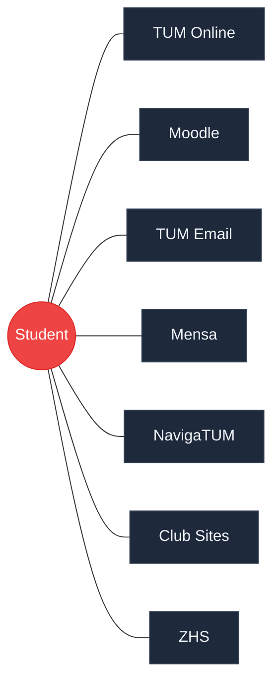

</div>

<div class="stat">30+ minutes every week</div>

Systems don't talk to each other. Students are the glue.

---
layout: image
image: /screenshot-empty.png
backgroundSize: contain
---

# What if it took **one message**?

<!-- Screenshot of empty AssisTUM UI with "Let's plan my next week" typed in chat -->

---
layout: image
image: /screenshot-populated.png
backgroundSize: contain
---

# **30 seconds later**

<!-- Screenshot of fully populated AssisTUM UI — calendar, todos, summary -->
```

- [ ] **Step 2: Verify slides 1–4 render**

```bash
cd /Users/max/misc/pj/hackathons/makeathon_2026/assistum/pitch-deck && npx slidev --port 3030 &
sleep 3
curl -s -o /dev/null -w "%{http_code}" http://localhost:3030
# Expected: 200
kill %1
```

- [ ] **Step 3: Commit**

```bash
git add pitch-deck/slides.md
git commit -m "feat: add slides 1-4 (title, problem, one message, result)"
```

---

### Task 4: Slides 5–6 (Cascade Flow + Agent Autonomy)

**Files:**
- Modify: `pitch-deck/slides.md`

- [ ] **Step 1: Add Slide 5 — What Just Happened (Mermaid cascade)**

Append to `pitch-deck/slides.md`:

```markdown

---

# One message. **Seven autonomous phases.**

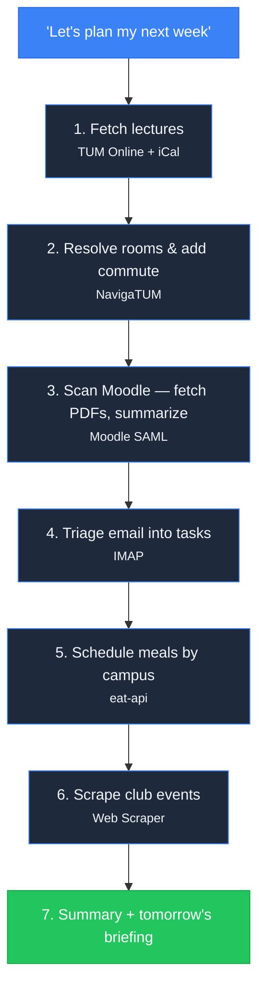

Each phase hits a **real external system**. No mocks. No pre-seeded data.
```

- [ ] **Step 2: Add Slide 6 — The Agent Acts**

Append to `pitch-deck/slides.md`:

```markdown

---

# It doesn't just fetch data — it **makes decisions**

<div class="three-cols">
<div class="col">

#### 🧭 Commute

Looked up every room in NavigaTUM, determined which campus each lecture is on, added travel time.

**No one told it to.**

</div>
<div class="col">

#### 🍽️ Mensa

Picked the closest canteen to your actual location that day. Chose a meal based on your preferences.

**Context-aware scheduling.**

</div>
<div class="col">

#### 📄 Moodle

Downloaded PDFs from course pages, extracted text, summarized them, linked summaries in your tasks.

**Reads and understands content.**

</div>
</div>
```

- [ ] **Step 3: Commit**

```bash
git add pitch-deck/slides.md
git commit -m "feat: add slides 5-6 (cascade flow diagram, agent autonomy)"
```

---

### Task 5: Slides 7–8 (Architecture + Integration Map)

**Files:**
- Modify: `pitch-deck/slides.md`

- [ ] **Step 1: Add Slide 7 — Architecture diagram**

Append to `pitch-deck/slides.md`:

```markdown

---

# MCP-Powered Agent Architecture

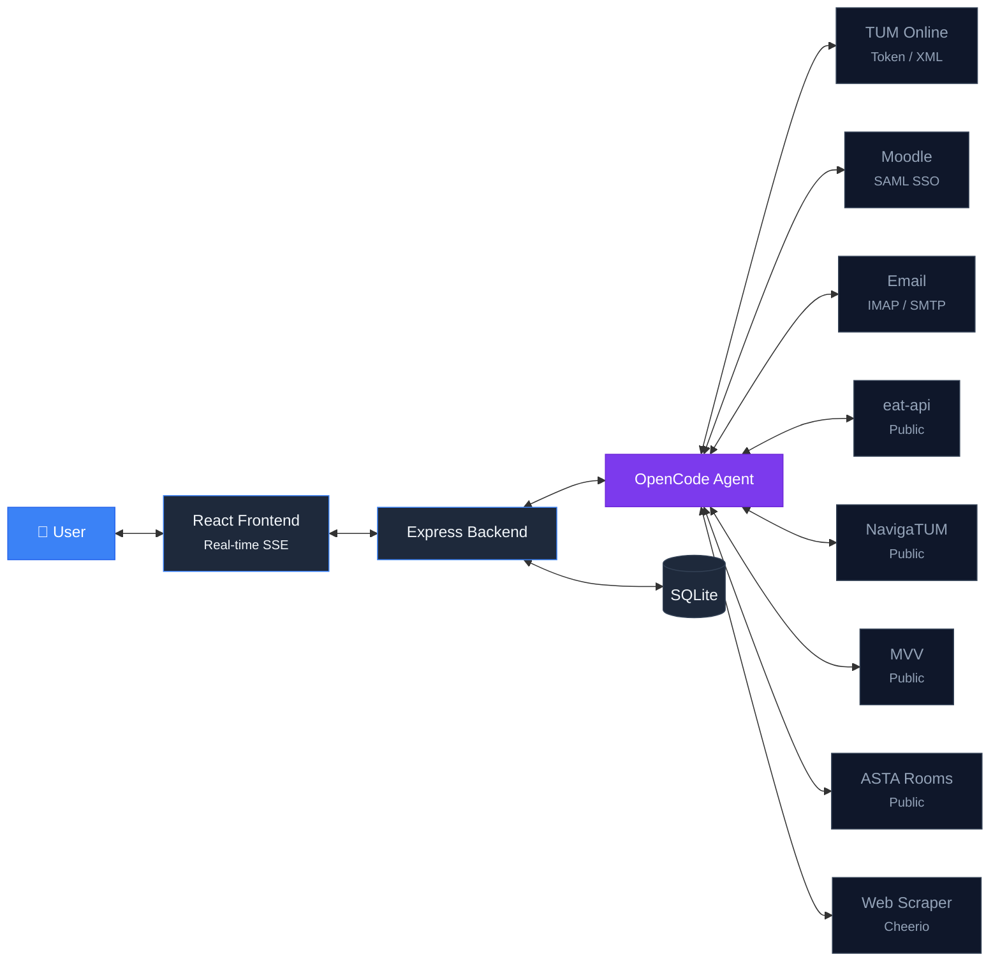

<div class="flex justify-center gap-8 mt-4">
  <div class="text-center"><span class="text-3xl font-bold text-blue-400">15+</span><br/><span class="text-sm opacity-70">MCP Tools</span></div>
  <div class="text-center"><span class="text-3xl font-bold text-blue-400">7</span><br/><span class="text-sm opacity-70">Agent Skills</span></div>
  <div class="text-center"><span class="text-3xl font-bold text-blue-400">8</span><br/><span class="text-sm opacity-70">External Systems</span></div>
</div>
```

- [ ] **Step 2: Add Slide 8 — Integration Map table**

Append to `pitch-deck/slides.md`:

```markdown

---

# 8 University Systems. **Real APIs. Real Auth.**

| System | Auth | Autonomous Actions |
|--------|------|--------------------|
| **Moodle** | SAML SSO | Fetches assignments, **downloads PDFs, extracts text, summarizes** |
| **TUM Online** | Token | Pulls lectures, syncs courses, fetches grades |
| **NavigaTUM** | Public | Resolves room codes → campus, **auto-generates commute blocks** |
| **Email** | IMAP/SMTP | Reads inbox, **triages into actionable tasks with deadlines** |
| **Mensa** | Public | Fetches menus, **picks closest canteen by schedule context** |
| **MVV** | Public | Live departures, **calculates when to leave** |
| **Clubs** | Web scrape | Extracts events from **arbitrary club websites** |
| **Study Rooms** | ASTA API | **Real-time availability** across campuses |
```

- [ ] **Step 3: Commit**

```bash
git add pitch-deck/slides.md
git commit -m "feat: add slides 7-8 (architecture diagram, integration map)"
```

---

### Task 6: Slides 9–12 (UI/UX, Impact, Capabilities, Closing)

**Files:**
- Modify: `pitch-deck/slides.md`

- [ ] **Step 1: Add Slide 9 — UI/UX**

Append to `pitch-deck/slides.md`:

```markdown

---
layout: image
image: /screenshot-ui-annotated.png
backgroundSize: contain
---

# One interface. **Zero learning curve.**

No forms. No dropdowns. Just conversation.

<!-- Annotated screenshot with callouts: Left=Tasks, Center=Calendar, Right=Chat -->
```

- [ ] **Step 2: Add Slide 10 — Impact**

Append to `pitch-deck/slides.md`:

```markdown

---
layout: center
---

# 30 minutes → **30 seconds**

<div class="before-after mt-8">
<div class="before">

#### Before

- 6 browser tabs open
- Manual copy-paste between systems
- Missed deadlines
- Forgotten lunches
- No travel time planning

</div>
<div class="after">

#### After

- One conversation
- Full week planned
- Every deadline tracked
- Campus-aware meals
- Commute blocks included

</div>
</div>

<div class="text-center mt-8 text-lg">

Works with **any TUM student's real credentials**, today. Not a prototype — a **working product**.

</div>
```

- [ ] **Step 3: Add Slide 11 — Full Capability Surface**

Append to `pitch-deck/slides.md`:

```markdown

---

# Not a chatbot. A **campus operating system.**

<div class="capability-grid">
<div class="capability-group">

#### Data Intelligence

- Fetches and reads PDFs, exercise sheets, and lecture slides from Moodle
- Extracts text from PDFs, summarizes content, links in tasks
- Scrapes any student club website for events
- Reads and triages university email

</div>
<div class="capability-group">

#### Autonomous Actions

- Resolves lecture rooms → determines campus → adds commute time
- Picks closest mensa by your schedule, selects meals
- Schedules study sessions around your deadlines
- Detects and resolves calendar conflicts

</div>
<div class="capability-group">

#### Real-Time Information

- Live MVV departures — when to leave and which train
- Study room availability across campuses
- Mensa occupancy — how crowded right now?
- Canteen menus for the full week

</div>
<div class="capability-group">

#### Agent Skills

- `/plan-week` — Build full week from 5+ systems
- `/review-lectures` — Review sessions with Moodle materials
- `/schedule-study-sessions` — Auto-schedule before deadlines
- `/commute-helper` `/find-study-room` `/conflict-resolver` `/course-brainstorm`

</div>
</div>
```

- [ ] **Step 4: Add Slide 12 — Closing**

Append to `pitch-deck/slides.md`:

```markdown

---
layout: center
class: text-center
---

# AssisTUM

**Being a student should be about learning — not logistics.**

<div class="mt-12 text-sm opacity-50">
Built in 48 hours. Ready to deploy.
</div>

<div class="mt-4 text-sm opacity-50">
Team AssisTUM — REPLY Makeathon 2026
</div>
```

- [ ] **Step 5: Commit**

```bash
git add pitch-deck/slides.md
git commit -m "feat: add slides 9-12 (UI/UX, impact, capabilities, closing)"
```

---

### Task 7: Appendix Slides A1–A4

**Files:**
- Modify: `pitch-deck/slides.md`

- [ ] **Step 1: Add section divider + A1 (TUM Online)**

Append to `pitch-deck/slides.md`:

```markdown

---
layout: section
---

# Appendix

Deep-dive into each integration

---

# <span class="appendix-badge">A1</span> TUM Online Integration

<div class="two-cols-content">

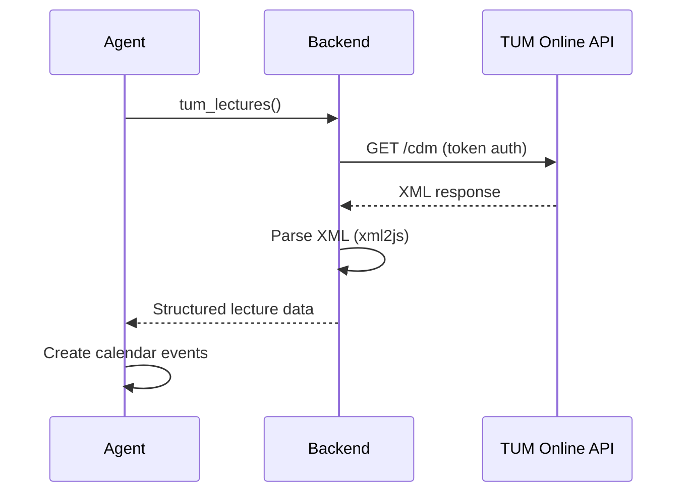

</div>

**Auth:** Token-based (email confirmation flow from TUM Online)

**Capabilities:**
- Fetch full lecture schedule (XML parsed)
- Sync courses to local database
- Fetch grades

**Data flow:** Token → XML API → xml2js parser → structured JSON → calendar events
```

- [ ] **Step 2: Add A2 (Moodle)**

Append to `pitch-deck/slides.md`:

```markdown

---

# <span class="appendix-badge">A2</span> Moodle Integration

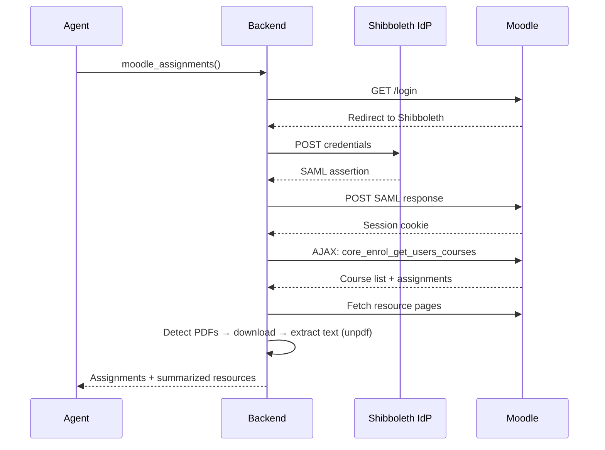

**Auth:** SAML Shibboleth SSO — auto-redirect chain, session caching, auto-refresh on expiry

**PDF Pipeline:** Moodle page → detect PDF → download → unpdf text extraction → summarize → store as task resource

The most technically complex integration. SAML auth alone is non-trivial.
```

- [ ] **Step 3: Add A3 (Email)**

Append to `pitch-deck/slides.md`:

```markdown

---

# <span class="appendix-badge">A3</span> Email Integration

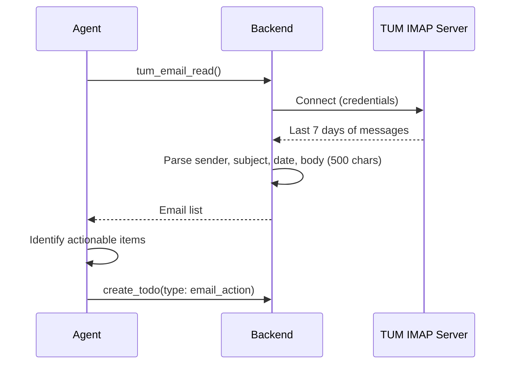

**Auth:** IMAP credentials (TUM email server) + SMTP for sending

**Capabilities:**
- Read inbox (configurable: last N days, message limit)
- Extract sender, subject, date, body snippet
- Send emails with reply tracking via SMTP

**Agent behavior:** Scans for actionable items, creates `email_action` todos with 48h default deadline unless email specifies one
```

- [ ] **Step 4: Add A4 (Mensa & Canteen)**

Append to `pitch-deck/slides.md`:

```markdown

---

# <span class="appendix-badge">A4</span> Mensa & Canteen

```mermaid {scale: 0.6}
graph LR
    CAL["📅 Today's Calendar"] --> CAMPUS["Determine Campus"]
    CAMPUS --> SEL["Select Closest Mensa"]
    SEL --> API["eat-api: Fetch Menu"]
    API --> MEAL["Pick Meal"]
    MEAL --> EVENT["Create Lunch Event"]
    style CAL fill:#1e293b,stroke:#3b82f6,color:#f1f5f9
    style CAMPUS fill:#1e293b,stroke:#3b82f6,color:#f1f5f9
    style SEL fill:#1e293b,stroke:#3b82f6,color:#f1f5f9
    style API fill:#1e293b,stroke:#f97316,color:#f1f5f9
    style MEAL fill:#1e293b,stroke:#f97316,color:#f1f5f9
    style EVENT fill:#f97316,stroke:#ea580c,color:#fff
```

**API:** TUM eat-api (public, no auth)

**Capabilities:**
- Weekly menus by location (mensa-garching, mensa-arcisstr, etc.)
- Live occupancy head count

**Agent behavior:** Cross-references calendar → determines campus → picks closest canteen → schedules lunch → selects meal
```

- [ ] **Step 5: Commit**

```bash
git add pitch-deck/slides.md
git commit -m "feat: add appendix slides A1-A4 (TUM Online, Moodle, Email, Mensa)"
```

---

### Task 8: Appendix Slides A5–A8

**Files:**
- Modify: `pitch-deck/slides.md`

- [ ] **Step 1: Add A5 (NavigaTUM & Commute)**

Append to `pitch-deck/slides.md`:

```markdown

---

# <span class="appendix-badge">A5</span> NavigaTUM & Commute

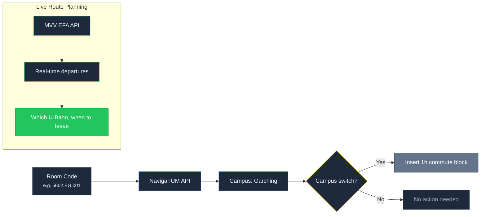

**APIs:** NavigaTUM (room/building search) + MVV EFA (real-time departures)

**Commute logic:** For each lecture → resolve room code → determine campus → if campus switch, insert 1h commute block

**Route planning:** NavigaTUM room lookup + MVV live departures → tells student which U-Bahn to take and when to leave
```

- [ ] **Step 2: Add A6 (Student Clubs)**

Append to `pitch-deck/slides.md`:

```markdown

---

# <span class="appendix-badge">A6</span> Student Clubs

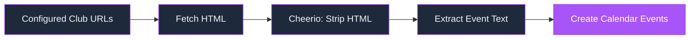

**Method:** Configurable club URLs + Cheerio HTML scraping

**Capabilities:** Scrapes arbitrary club websites, strips HTML, extracts event text

**Resilience:** Handles errors gracefully — skips clubs that fail, continues with rest

Works with **any** student club website — no special API needed
```

- [ ] **Step 3: Add A7 (Study Rooms)**

Append to `pitch-deck/slides.md`:

```markdown

---

# <span class="appendix-badge">A7</span> Study Rooms

**API:** ASTA study room API (public)

**Capabilities:**
- Real-time room availability across TUM campuses
- Filters by proximity to student's current/upcoming location
- Reports available rooms with building details

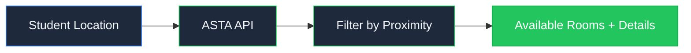

Accessed via `/find-study-room` slash command or natural language request
```

- [ ] **Step 4: Add A8 (Agent Engine)**

Append to `pitch-deck/slides.md`:

```markdown

---

# <span class="appendix-badge">A8</span> The Agent Engine

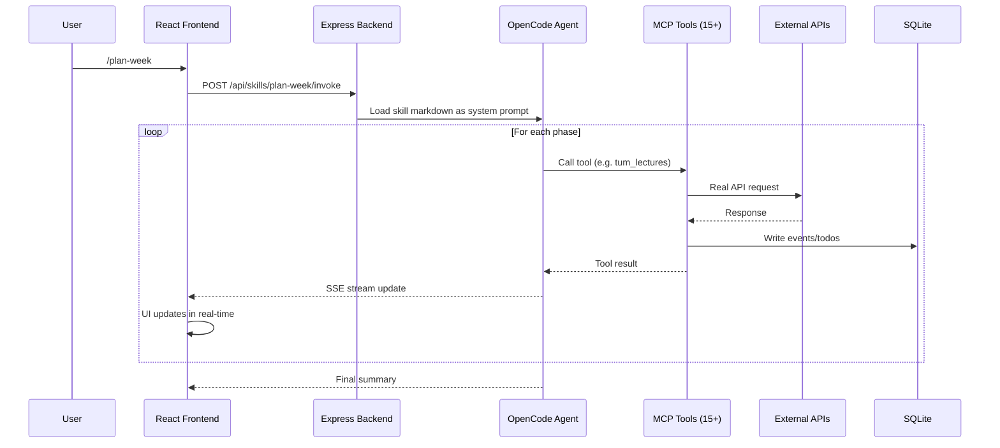

**Engine:** OpenCode SDK — agent spawned as local server

**Protocol:** Model Context Protocol (MCP) — 15+ tools exposed to agent

**Skills:** 7 markdown-defined workflows, loaded dynamically

**Error handling:** Per-tool graceful degradation — if one integration fails, agent skips and continues
```

- [ ] **Step 5: Commit**

```bash
git add pitch-deck/slides.md
git commit -m "feat: add appendix slides A5-A8 (NavigaTUM, clubs, study rooms, agent engine)"
```

---

### Task 9: Placeholder Screenshots and Final Verification

**Files:**
- Create: `pitch-deck/public/screenshot-empty.png` (placeholder)
- Create: `pitch-deck/public/screenshot-populated.png` (placeholder)
- Create: `pitch-deck/public/screenshot-ui-annotated.png` (placeholder)

- [ ] **Step 1: Create placeholder images**

Create simple placeholder PNGs so slides render without broken images. These will be replaced with real screenshots later.

```bash
cd /Users/max/misc/pj/hackathons/makeathon_2026/assistum/pitch-deck
# Create 1x1 dark placeholder PNGs using ImageMagick (or just touch them)
for f in screenshot-empty.png screenshot-populated.png screenshot-ui-annotated.png; do
  convert -size 980x550 xc:'#0f172a' -gravity center -fill '#334155' -pointsize 24 -annotate 0 "Replace with real screenshot: $f" "public/$f" 2>/dev/null || touch "public/$f"
done
```

- [ ] **Step 2: Verify full deck renders**

```bash
cd /Users/max/misc/pj/hackathons/makeathon_2026/assistum/pitch-deck && npx slidev --port 3030 &
sleep 5
curl -s -o /dev/null -w "%{http_code}" http://localhost:3030
# Expected: 200
# Navigate through all slides manually in browser at http://localhost:3030
kill %1
```

- [ ] **Step 3: Test PDF export**

```bash
cd /Users/max/misc/pj/hackathons/makeathon_2026/assistum/pitch-deck && npx slidev export --dark --output assistum-pitch-deck
# Expected: assistum-pitch-deck.pdf created in pitch-deck directory
ls -la assistum-pitch-deck.pdf
```

- [ ] **Step 4: Commit**

```bash
git add pitch-deck/public/
git commit -m "feat: add placeholder screenshots, verify deck renders"
```

---

### Task 10: Capture Real Screenshots

This task is manual — requires the AssisTUM app to be running.

- [ ] **Step 1: Start the app**

```bash
cd /Users/max/misc/pj/hackathons/makeathon_2026/assistum
# Start backend + frontend
npm run dev
```

- [ ] **Step 2: Capture empty UI screenshot**

1. Open browser to `http://localhost:5173`
2. Ensure calendar shows current week, todos empty, chat empty
3. Type "Let's plan my next week" in chat input but **do not send**
4. Take screenshot → save as `pitch-deck/public/screenshot-empty.png`

- [ ] **Step 3: Capture populated UI screenshot**

1. Send the message and wait for cascade to complete
2. Take screenshot of the fully populated state → save as `pitch-deck/public/screenshot-populated.png`

- [ ] **Step 4: Create annotated UI screenshot**

1. Take the populated screenshot
2. Add annotation callouts (in any image editor or Figma):
   - Left panel: "Tasks with deadlines, priorities, and linked Moodle resources"
   - Center panel: "Real-time calendar with color-coded event types"
   - Right panel: "Natural language chat with slash commands"
3. Save as `pitch-deck/public/screenshot-ui-annotated.png`

- [ ] **Step 5: Commit**

```bash
git add pitch-deck/public/
git commit -m "feat: add real screenshots to pitch deck"
```
