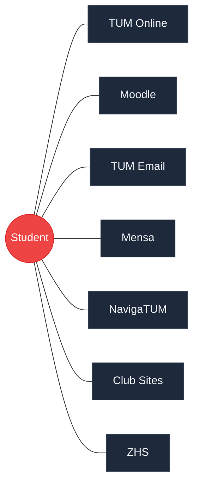
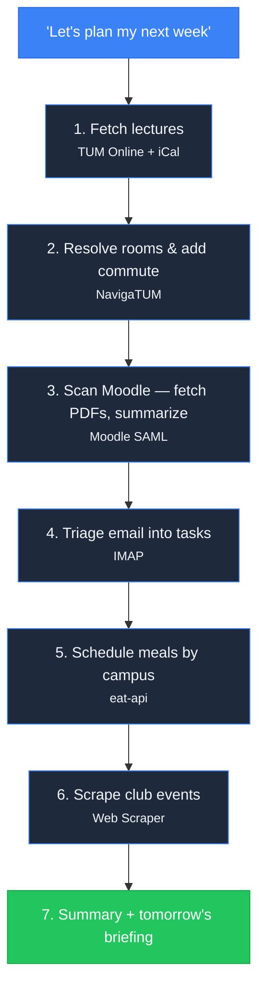
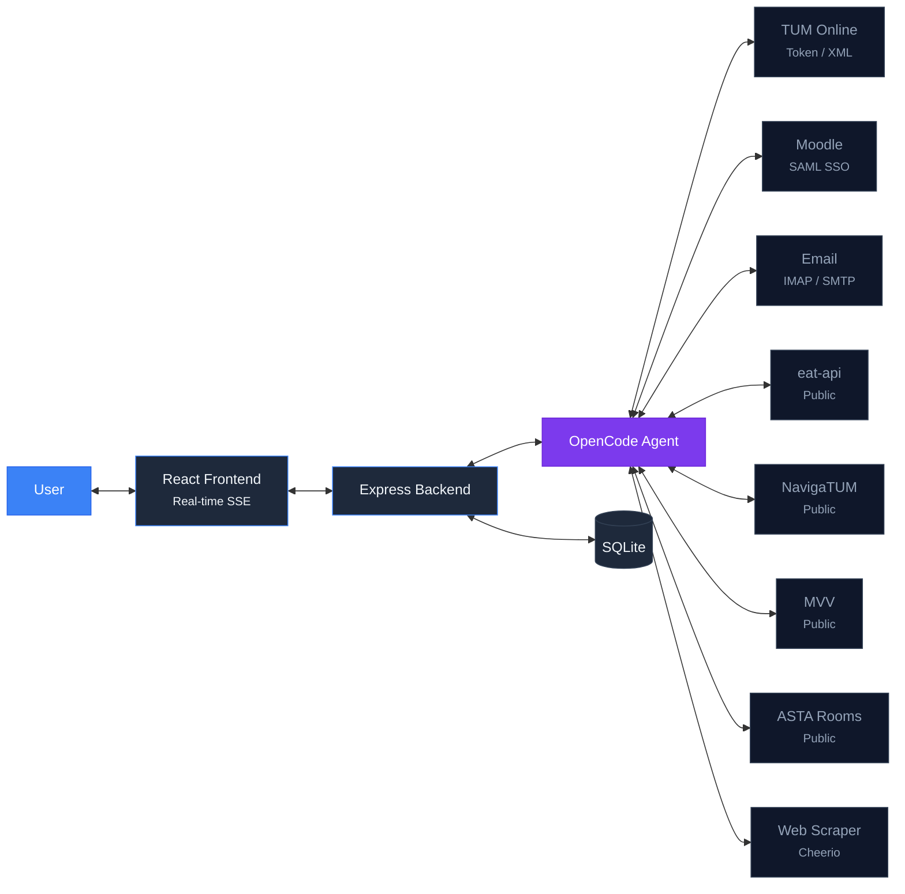

# AssisTUM

Your Autonomous Campus Co-Pilot

  REPLY Makeathon 2026 — Team AssisTUM

---
layout: center
---

# Students are **human APIs**

30+ minutes every week

Systems don't talk to each other. Students are the glue.

---
layout: image
image: /screenshot-empty.png
backgroundSize: contain
---

# What if it took **one message**?

---
layout: image
image: /screenshot-populated.png
backgroundSize: contain
---

# **30 seconds later**

---

# One message. **Seven autonomous phases.**

Each phase hits a **real external system**. No mocks. No pre-seeded data.

---

# It doesn't just fetch data — it **makes decisions**

#### Commute

Looked up every room in NavigaTUM, determined which campus each lecture is on, added travel time.

**No one told it to.**

#### Mensa

Picked the closest canteen to your actual location that day. Chose a meal based on your preferences.

**Context-aware scheduling.**

#### Moodle

Downloaded PDFs from course pages, extracted text, summarized them, linked summaries in your tasks.

**Reads and understands content.**

---

# MCP-Powered Agent Architecture

  
15+ MCP Tools

  
7 Agent Skills

  
8 External Systems

---

# 8 University Systems. **Real APIs. Real Auth.**

| System | Auth | Autonomous Actions |
|--------|------|--------------------|
| **Moodle** | SAML SSO | Fetches assignments, **downloads PDFs, extracts text, summarizes** |
| **TUM Online** | Token | Pulls lectures, syncs courses, fetches grades |
| **NavigaTUM** | Public | Resolves room codes → campus, **auto-generates commute blocks** |
| **Email** | IMAP/SMTP | Reads inbox, **triages into actionable tasks with deadlines** |
| **Mensa** | Public | Fetches menus, **picks closest canteen by schedule context** |
| **MVV** | Public | Live departures, **calculates when to leave** |
| **Clubs** | Web scrape | Extracts events from **arbitrary club websites** |
| **Study Rooms** | ASTA API | **Real-time availability** across campuses |
