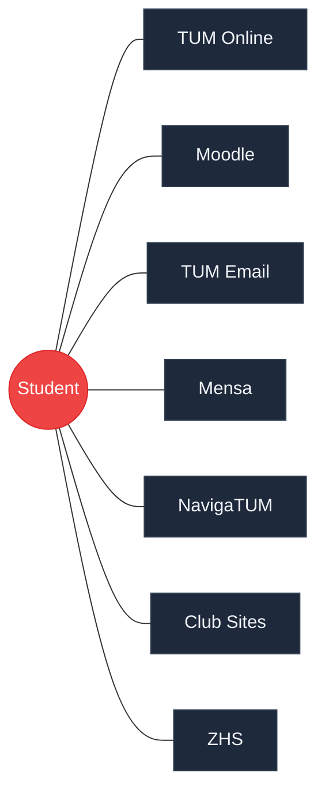
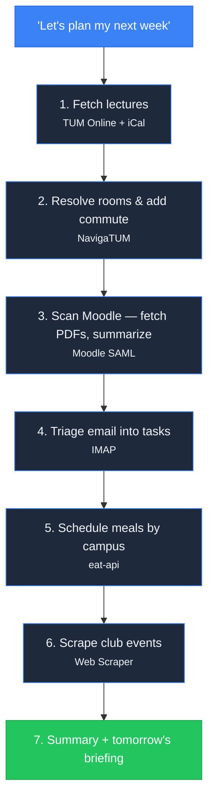
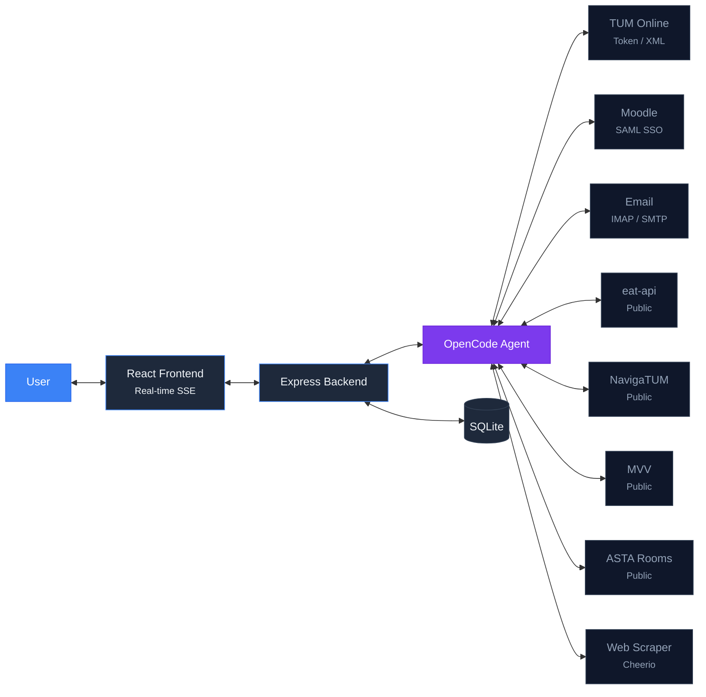
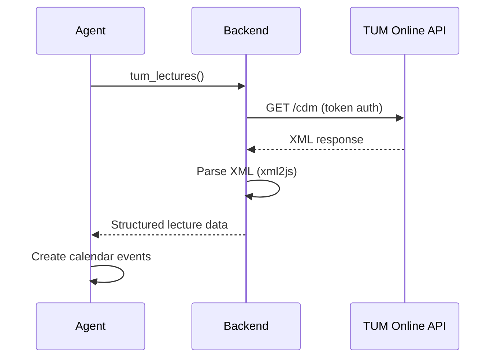
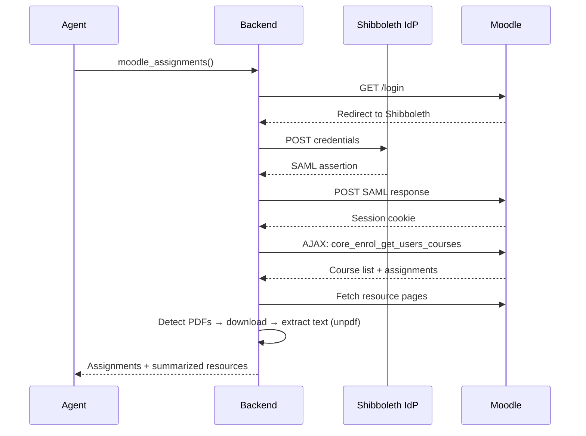
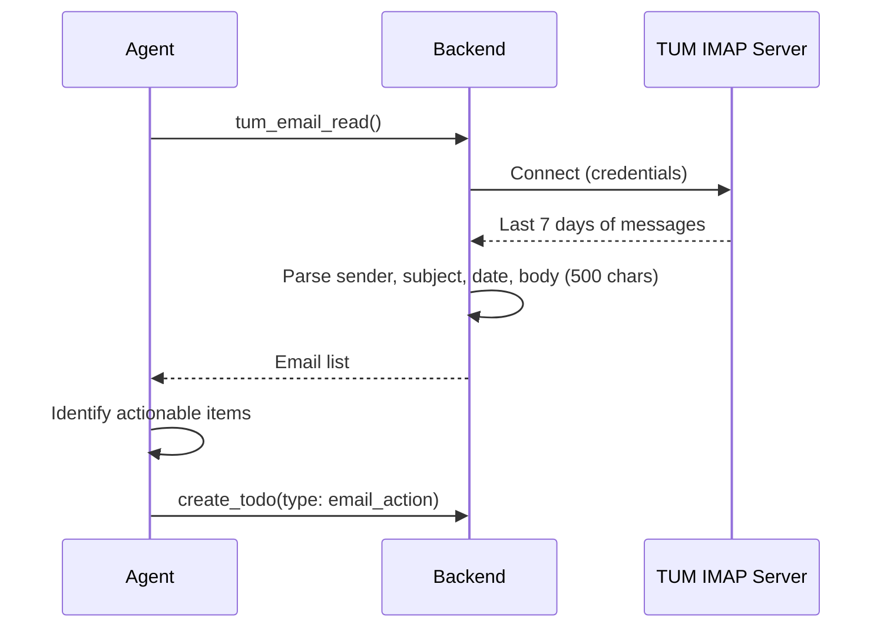
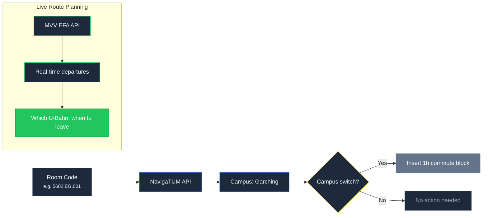
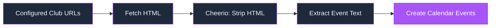
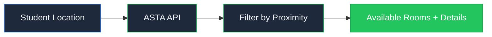
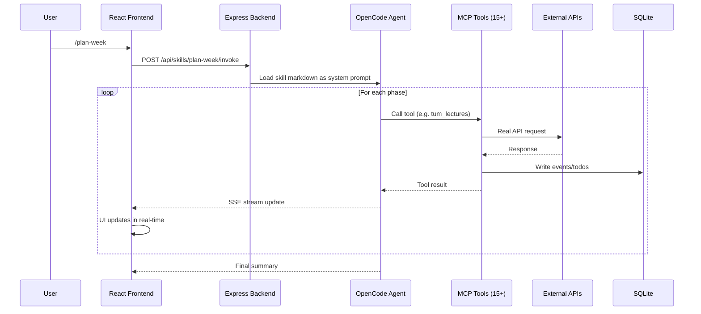

# AssisTUM

Your Autonomous Campus Co-Pilot

  REPLY Makeathon 2026 — Team AssisTUM

---
layout: center
---

# Students are **human APIs**

30+ minutes every week

Systems don't talk to each other. Students are the glue.

---
layout: image
image: /screenshot-empty.png
backgroundSize: contain
---

# What if it took **one message**?

---
layout: image
image: /screenshot-populated.png
backgroundSize: contain
---

# **30 seconds later**

---

# One message. **Seven autonomous phases.**

Each phase hits a **real external system**. No mocks. No pre-seeded data.

---

# It doesn't just fetch data — it **makes decisions**

#### Commute

Looked up every room in NavigaTUM, determined which campus each lecture is on, added travel time.

**No one told it to.**

#### Mensa

Picked the closest canteen to your actual location that day. Chose a meal based on your preferences.

**Context-aware scheduling.**

#### Moodle

Downloaded PDFs from course pages, extracted text, summarized them, linked summaries in your tasks.

**Reads and understands content.**

---

# MCP-Powered Agent Architecture

  
15+ MCP Tools

  
7 Agent Skills

  
8 External Systems

---

# 8 University Systems. **Real APIs. Real Auth.**

| System | Auth | Autonomous Actions |
|--------|------|--------------------|
| **Moodle** | SAML SSO | Fetches assignments, **downloads PDFs, extracts text, summarizes** |
| **TUM Online** | Token | Pulls lectures, syncs courses, fetches grades |
| **NavigaTUM** | Public | Resolves room codes → campus, **auto-generates commute blocks** |
| **Email** | IMAP/SMTP | Reads inbox, **triages into actionable tasks with deadlines** |
| **Mensa** | Public | Fetches menus, **picks closest canteen by schedule context** |
| **MVV** | Public | Live departures, **calculates when to leave** |
| **Clubs** | Web scrape | Extracts events from **arbitrary club websites** |
| **Study Rooms** | ASTA API | **Real-time availability** across campuses |

---
layout: image
image: /screenshot-ui-annotated.png
backgroundSize: contain
---

# One interface. **Zero learning curve.**

No forms. No dropdowns. Just conversation.

---
layout: center
---

# 30 minutes → **30 seconds**

#### Before

- 6 browser tabs open
- Manual copy-paste between systems
- Missed deadlines
- Forgotten lunches
- No travel time planning

#### After

- One conversation
- Full week planned
- Every deadline tracked
- Campus-aware meals
- Commute blocks included

Works with **any TUM student's real credentials**, today. Not a prototype — a **working product**.

---

# Not a chatbot. A **campus operating system.**

#### Data Intelligence

- Fetches and reads PDFs, exercise sheets, and lecture slides from Moodle
- Extracts text from PDFs, summarizes content, links in tasks
- Scrapes any student club website for events
- Reads and triages university email

#### Autonomous Actions

- Resolves lecture rooms → determines campus → adds commute time
- Picks closest mensa by your schedule, selects meals
- Schedules study sessions around your deadlines
- Detects and resolves calendar conflicts

#### Real-Time Information

- Live MVV departures — when to leave and which train
- Study room availability across campuses
- Mensa occupancy — how crowded right now?
- Canteen menus for the full week

#### Agent Skills

- `/plan-week` — Build full week from 5+ systems
- `/review-lectures` — Review sessions with Moodle materials
- `/schedule-study-sessions` — Auto-schedule before deadlines
- `/commute-helper` `/find-study-room` `/conflict-resolver` `/course-brainstorm`

---
layout: center
class: text-center
---

# AssisTUM

**Being a student should be about learning — not logistics.**

Built in 48 hours. Ready to deploy.

Team AssisTUM — REPLY Makeathon 2026

---
layout: section
---

# Appendix

Deep-dive into each integration

---

# A1 TUM Online Integration

**Auth:** Token-based (email confirmation flow from TUM Online)

**Capabilities:**
- Fetch full lecture schedule (XML parsed)
- Sync courses to local database
- Fetch grades

**Data flow:** Token → XML API → xml2js parser → structured JSON → calendar events

---

# A2 Moodle Integration

**Auth:** SAML Shibboleth SSO — auto-redirect chain, session caching, auto-refresh on expiry

**PDF Pipeline:** Moodle page → detect PDF → download → unpdf text extraction → summarize → store as task resource

The most technically complex integration. SAML auth alone is non-trivial.

---

# A3 Email Integration

**Auth:** IMAP credentials (TUM email server) + SMTP for sending

**Capabilities:**
- Read inbox (configurable: last N days, message limit)
- Extract sender, subject, date, body snippet
- Send emails with reply tracking via SMTP

**Agent behavior:** Scans for actionable items, creates `email_action` todos with 48h default deadline unless email specifies one

---

# A4 Mensa & Canteen

**API:** TUM eat-api (public, no auth)

**Capabilities:**
- Weekly menus by location (mensa-garching, mensa-arcisstr, etc.)
- Live occupancy head count

**Agent behavior:** Cross-references calendar → determines campus → picks closest canteen → schedules lunch → selects meal

---

# A5 NavigaTUM & Commute

**APIs:** NavigaTUM (room/building search) + MVV EFA (real-time departures)

**Commute logic:** For each lecture → resolve room code → determine campus → if campus switch, insert 1h commute block

**Route planning:** NavigaTUM room lookup + MVV live departures → tells student which U-Bahn to take and when to leave

---

# A6 Student Clubs

**Method:** Configurable club URLs + Cheerio HTML scraping

**Capabilities:** Scrapes arbitrary club websites, strips HTML, extracts event text

**Resilience:** Handles errors gracefully — skips clubs that fail, continues with rest

Works with **any** student club website — no special API needed

---

# A7 Study Rooms

**API:** ASTA study room API (public)

**Capabilities:**
- Real-time room availability across TUM campuses
- Filters by proximity to student's current/upcoming location
- Reports available rooms with building details

Accessed via `/find-study-room` slash command or natural language request

---

# A8 The Agent Engine

**Engine:** OpenCode SDK — agent spawned as local server

**Protocol:** Model Context Protocol (MCP) — 15+ tools exposed to agent

**Skills:** 7 markdown-defined workflows, loaded dynamically

**Error handling:** Per-tool graceful degradation — if one integration fails, agent skips and continues
