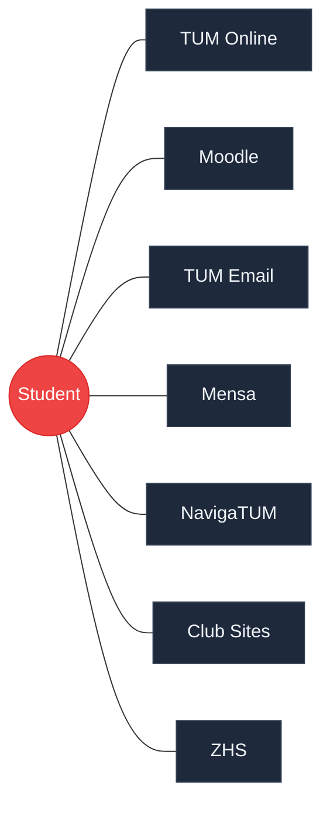

# AssisTUM

Your Autonomous Campus Co-Pilot

  REPLY Makeathon 2026 — Team AssisTUM

---
layout: center
---

# Students are **human APIs**

30+ minutes every week

Systems don't talk to each other. Students are the glue.

---
layout: image
image: /screenshot-empty.png
backgroundSize: contain
---

# What if it took **one message**?

---
layout: image
image: /screenshot-populated.png
backgroundSize: contain
---

# **30 seconds later**
